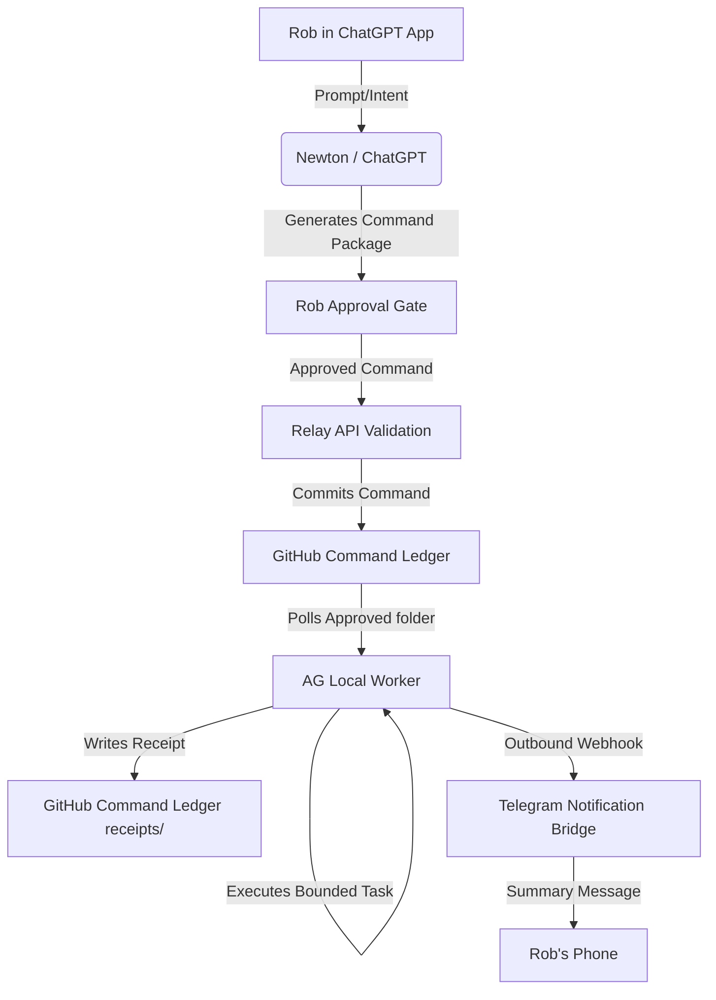

# System Architecture

## Data Flow Diagram

## Component Breakdown

1.  **Newton/ChatGPT:** Formulates structured commands matching `COMMAND_SCHEMA.json` based on conversations.
2.  **Relay API:** Runs validation checks, ensures integrity checks, and handles authentication.
3.  **Command Ledger:** Local filesystem simulating a Git-backed JSON data store for command records.
4.  **AG Local Worker:** The client daemon that picks up approved commands, executes tasks safely within allowed paths, and writes receipts.
5.  **Telegram Bridge:** Outbound notification gate sending execution success summaries back to Rob's phone.
