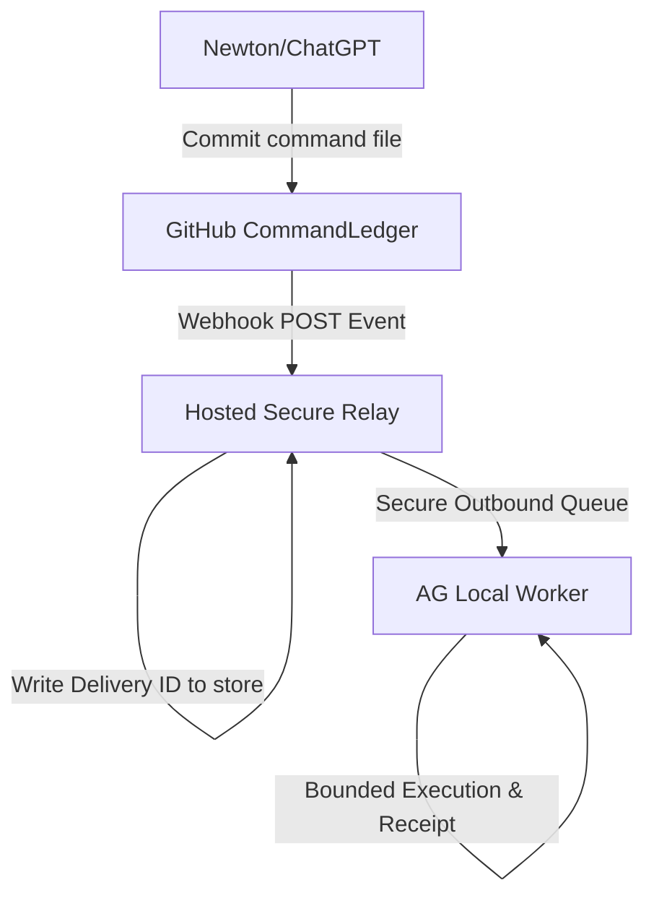

# Safe Webhook Architecture

This document describes the design and flow for safe webhook ingestion inside the Newton ↔ AG Phone Bridge.

## End-to-End Data Flow

## Security Safeguards

1.  **HMAC SHA-256 Signature Verification (`X-Hub-Signature-256`):**
    All incoming requests must provide an `X-Hub-Signature-256` header which is validated against the raw request body using a pre-shared secret key. Comparison is performed using a constant-time check (`crypto.timingSafeEqual`) to prevent timing side-channel attacks.
2.  **Strict Branch Validation:**
    Only commits destined for the target sandbox branch `newton-ag-bridge-v2-ledger-dry-run` are accepted. Webhooks from other branches are immediately dropped.
3.  **Strict Directory Path Validation:**
    The webhook handler extracts file paths modified in the commit. It only accepts file additions/modifications located strictly within `CommandLedger/approved/`. Any edits outside this folder will cause the payload to be rejected.
4.  **Replay Prevention:**
    Every webhook payload contains a unique `X-GitHub-Delivery` GUID. This GUID is logged in `CommandLedger/webhook_deliveries/`. Any request with a duplicate delivery ID is rejected.
5.  **No Local PC Direct Ports:**
    The webhook endpoint is never deployed directly on the local machine. It runs in a secure cloud relay layer, which securely communicates with the local AG daemon using outbound polling or secure queues.
